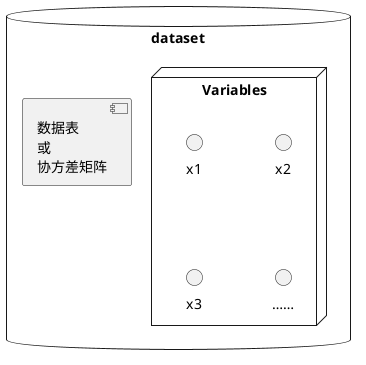
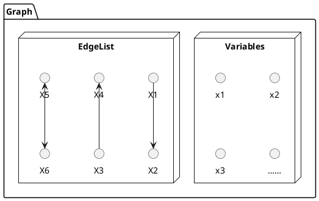

# 重要概念

## 变量 = 节点 = 顶点

因果推断是个科学发现问题，所以随机变量是最基本的概念。在因果图中，变量以**节点**或**顶点**的形式存在。

在其他图工具中，一般是先构建图，然后再填入节点。如果图不存在了节点也随之消失。与这些图工具不同，bcoz将节点视为基本对象。
你可以用同一组节点构建多个图。这与我们处理科学问题的思路一致：先知晓变量，然后从中获得因果关系。

变量可以是**离散值**也可以是**连续值**，不同数值类型对应不同的搜索算法。

当导入数据时变量会自动创建，或者手动创建图时手动创建变量。

## 数据集

数据集分为2部分：第一部分是变量集合 $V$，第二部分是这些变量的观测值集合 $X$ 或这些变量的协方差矩阵 $\Sigma$。

数据集在导入数据时创建。

## 图

