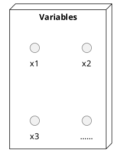
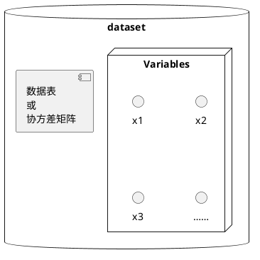
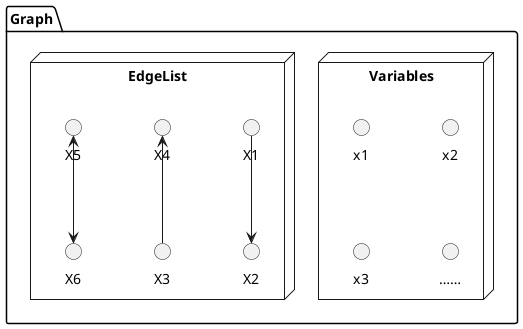
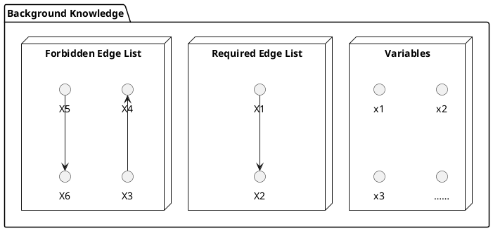
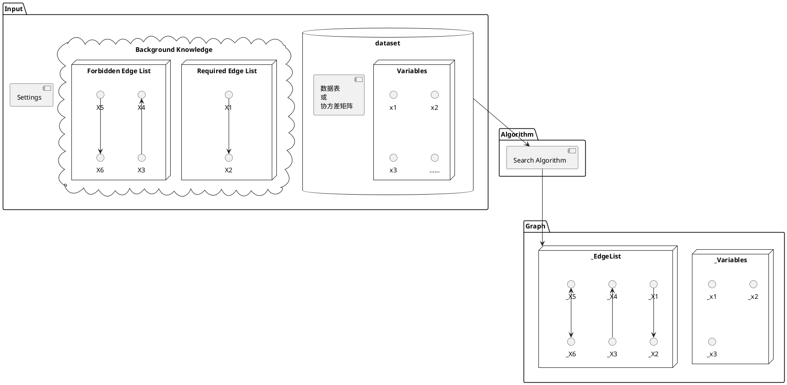

# 重要概念

## 变量 = 节点 = 顶点

因果推断是个科学发现问题，所以随机变量是最基本的概念。在因果图中，变量以**节点**或**顶点**的形式存在。

在其他图工具中，一般是先构建图，然后再填入节点。如果图不存在了节点也随之消失。与这些图工具不同，bcoz将节点视为基本对象。
你可以用同一组节点构建多个图。这与我们处理科学问题的思路一致：先知晓变量，然后从中获得因果关系。

变量可以是**离散值**也可以是**连续值**，不同数值类型对应不同的搜索算法。

当导入数据时变量会自动创建，或者手动创建图时手动创建变量。

## 数据集

数据集分为2部分：第一部分是变量集合 $V$，第二部分是这些变量的观测值集合 $X$ 或这些变量的协方差矩阵 $\Sigma$。

数据集在导入数据时创建。

## 图

图 $G$ 由节点集合 $V$ 和边集合 $E$ 组成。每条边有4部分信息：一对节点和一对端点。
例如边 $(A, B, -, >)$ 表示 $A \rarr B$，边 $(B, C, >, >)$ 表示 $B \leftrightarrow C$ 。
这使得图的表示非常灵活：既可以表示无向边，也可以表示双向边，甚至一些特殊边。
边 $A \rarr B$ 也以描述为“A对B存在直接因果效应”。

## 背景知识

在因果发现算法中，往往需要背景知识（先验知识）作为输入辅助搜索。
背景知识由一组变量、禁忌边列表和必要边列表组成。

构建背景知识时你可以将背景知识视为独立内容--这也就是为什么称其为背景知识。
但是背景知识不能脱离输入的变量，只有这样才能建立禁忌边和必要边，也就是“关于什么的知识”。

## 搜索算法

因果发现问题可以简单理解为，首先我们有一组变量，然后在这些变量能组成的 *所有* 图中，找到一个能够正确描述这些变量之间因果关系的图。

到底要搜索多少图呢？

| 变量数 | 有向无环图数 |
| ----- | -----------|
| 1     | 1          |
| 2     | 3          |
| 3     | 25         |
| 4     | 543        |
| 5     | 29281      |
| 6     | 3781503    |
| ...   | ...        |
| 20    | 超过宇宙中原子的数量    |

这就是为什么我们需要一个算法来搜索，而不是人眼来检查。搜索算法会用很多技巧快速找到答案，不会一个一个图去分析。

搜索算法是一个函数，有对应的输入和输出。输入项为：

* 数据集（必选）
* 背景知识
* 算法设置，不同算法设置参数不同

输出为一个图或与数据相容的一组图（也叫图的“等价类”）。图的类型根据算法不同而不同。